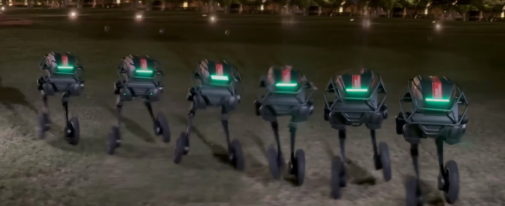
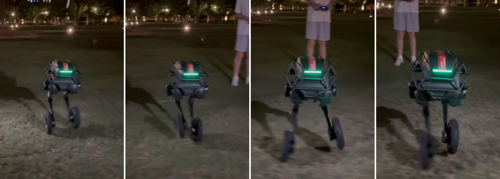

# video_image_tools

Tools for turning robot videos into paper figures:

- [`motion-trail`](#motion-trail): several poses of a moving robot composed into one scene.
- [`keyframes`](#keyframes): N keyframes of a clip as side-by-side panels.

## Install

Requires [uv](https://docs.astral.sh/uv/). ffmpeg is bundled via `imageio-ffmpeg`, so no system install is needed.

```bash
git clone https://github.com/Leixinjonaschang/video_image_tools.git
cd video_image_tools
uv sync                # core tools
uv sync --extra sam    # optional: SAM 2 robot tracking (motion-trail --moving-camera, keyframes --follow)
```

Both tools decode iPhone HDR (HLG/PQ) footage with automatic tone-mapping to SDR, accept times as seconds (`99.5`) or `m:ss` (`1:39.5`), and offer `--preview` to save the clip's first frame with a pixel grid for reading off box coordinates.

## motion-trail

Composes several poses of a moving robot from a video clip into one still image (a "multi-exposure" / motion-trail figure).


<sub>A wheel-legged robot crossing a step, 6 instances from a 6-second iPhone HDR clip (`--start 1:39 --end 1:45`).</sub>

How it works:

1. Decodes the clip with ffmpeg; iPhone HDR (HLG/PQ) footage is tone-mapped to SDR automatically.
2. Estimates the empty background as the per-pixel median of the clip.
3. Segments the robot in each frame by colour difference to the background, keeping thin parts and soft contact shadows.
4. Picks frames evenly spaced along the robot's path, pastes them onto the background, and crops to the motion.

This default mode assumes a **static camera** and **one moving object** in the clip. For hand-held or tracking shots, see [Moving camera](#moving-camera).

### Usage

```bash
# 6 instances from 1:39 to 1:45
uv run motion-trail path/to/video.mov --start 1:39 --end 1:45

# 8 instances, earlier poses fading in, custom output path
uv run motion-trail path/to/video.mov --start 99 --end 105 -n 8 --opacity 0.35 1 -o fig.png

# hand-pick the exact moments
uv run motion-trail path/to/video.mov --start 99 --end 105 --times 99.0 100.8 102.1 103.4 104.9
```

Outputs `outputs/<video>_<start>-<end>.png` (cropped) and `..._full.png` (full frame).

### Options

| Option | Default | Description |
| --- | --- | --- |
| `video` | – | Input video file |
| `--start`, `--end` | required | Clip range, in seconds (`99.5`) or `m:ss` (`1:39.5`) |
| `-n`, `--num` | `6` | Number of robot instances |
| `--spacing {distance,time}` | `distance` | Space instances evenly along the path travelled, or evenly in time |
| `--times T [T ...]` | – | Explicit timestamps; overrides `--num` / `--spacing` |
| `--order {later,earlier}` | `later` | Which instance is drawn on top where they overlap |
| `--opacity FIRST LAST` | `1 1` | Opacity of the first and last instance, interpolated in between |
| `--thresh LO HI` | `5 14` | Colour-difference (ΔE) thresholds: below `LO` is background, above `HI` is solid robot |
| `--bg-range START END` | the clip | Time range used to estimate the empty background |
| `--margin` | `0.25` | Crop padding as a fraction of robot height |
| `--aspect` | – | Force the crop to this width/height ratio (e.g. `3`) |
| `--no-crop` | off | Keep the full frame |
| `-o`, `--out` | `outputs/...png` | Output image path |
| `--debug` | off | Also save the background and per-instance mask overlays |
| `--preview` | off | Save the clip's first frame with a pixel grid and exit (to read off `--box`) |

### Moving camera

For footage where the camera follows the robot (hand-held, walking alongside), add `--moving-camera`.



<sub>A wheel-legged robot walking sideways at night, filmed hand-held while walking alongside; 6 instances from a 3-second clip. The operator standing behind the robot was removed automatically.</sub>

How it works:

1. [SAM 2](https://huggingface.co/facebook/sam2.1-hiera-small) tracks the robot from a box you draw on the first frame.
2. Frames are registered with a similarity transform fitted to the ground around the robot's feet, so robots stay upright and undistorted despite parallax.
3. People (e.g. operators) are detected with Mask R-CNN and removed by filling in the background from other frames.
4. The chosen frames are stitched into a wide panorama, one feathered strip per robot instance.

Needs the optional ML dependencies (PyTorch, transformers). Model weights (~0.4 GB) download on first use; runs on CUDA, Apple MPS or CPU.

#### Usage

```bash
# 0. install the optional dependencies (once)
uv sync --extra sam

# 1. save the clip's first frame with a pixel grid -> outputs/<video>_<start>-<end>_preview.png
uv run motion-trail path/to/video.mov --start 4 --end 7 --preview

# 2. read the robot's box off the grid (left, top, right, bottom) and make the figure
uv run motion-trail path/to/video.mov --start 4 --end 7 --moving-camera --box 670 250 820 540

# faster (~2x): analyse at 15 fps instead of the source rate
uv run motion-trail path/to/video.mov --start 4 --end 7 --moving-camera --box 670 250 820 540 --fps 15

# keep the operator in the shot, 8 instances, check the robot masks
uv run motion-trail path/to/video.mov --start 4 --end 7 --moving-camera --box 670 250 820 540 --keep-people -n 8 --debug
```

The box only needs to roughly enclose the robot in the **first frame of the clip**; SAM 2 follows it from there. A 3-second 720p clip takes about 1.5 min on an Apple M-series GPU (most of it SAM 2).

#### Options

| Option | Default | Description |
| --- | --- | --- |
| `--moving-camera` | off | Enable the moving-camera pipeline |
| `--box X0 Y0 X1 Y1` | required | Robot bounding box in the clip's first frame, in video pixels |
| `--keep-people` | off | Don't remove people from the background |
| `--fps` | source rate | Analyse the clip at a lower frame rate; `15` is about 2× faster |
| `--sam-model` | `facebook/sam2.1-hiera-small` | SAM 2 video checkpoint on Hugging Face |

`--num`, `--spacing`, `--times`, `--order`, `--margin`, `--aspect`, `--no-crop`, `-o` and `--debug` work as above; `--opacity`, `--thresh` and `--bg-range` don't apply.

### Tips

- **Ghost of the robot in the background**: the robot stood still for most of the clip. Pass a `--bg-range` where it keeps moving or is out of view.
- **Parts of the robot missing**: lower `--thresh` (e.g. `4 10`). **Background speckles pasted in**: raise it. Check with `--debug`.
- **Instances overlap too much**: reduce `-n` or use a longer clip.
- **Moving camera, robot mask wrong**: check `--debug` overlays; tighten `--box`, or try `--sam-model facebook/sam2.1-hiera-large`.
- **Moving camera, ghosts of people left over**: use the full frame rate (drop `--fps`) so more frames are available to fill from.

## keyframes

Picks N keyframes from a clip and tiles them side by side, optionally cropped to follow the robot.



<sub>4 keyframes from a 3-second hand-held clip with `--follow`: every panel is the same size, centred on the robot.</sub>

- Keyframes are evenly spaced in time from `--start` to `--end` (or given with `--times`).
- Around each target time, the frame with the least camera motion (within `--snap` seconds) is used, which avoids motion-blurred frames from hand-held footage.
- Panels are full frames, a fixed `--crop` region, or (with `--follow`) equal-size crops centred on the robot tracked by SAM 2, with `--margin` of space left on every side.

### Usage

```bash
# 4 full frames in one row
uv run keyframes path/to/video.mov --start 4 --end 7 -n 4

# same crop for every panel, 2x2 grid
uv run keyframes path/to/video.mov --start 4 --end 7 -n 4 --crop 380 0 1000 720 --cols 2

# follow the robot (box read off the --preview image), extra space around it
uv run keyframes path/to/video.mov --start 4 --end 7 -n 4 --follow --box 670 250 820 540 --margin 0.3
```

Outputs `outputs/<video>_<start>-<end>_keyframes.png`.

### Options

| Option | Default | Description |
| --- | --- | --- |
| `video` | – | Input video file |
| `--start`, `--end` | required | Clip range |
| `-n`, `--num` | `4` | Number of keyframes, evenly spaced in time |
| `--times T [T ...]` | – | Explicit timestamps; overrides `--num` |
| `--snap` | `0.1` | Use the least motion-blurred frame within ±`SNAP` seconds of each target (`0` = exact) |
| `--crop X0 Y0 X1 Y1` | full frame | Crop every panel to this box, in video pixels |
| `--cols` | all in one row | Panels per row |
| `--gap` | `6` | White gap between panels, in pixels |
| `-o`, `--out` | `outputs/...png` | Output image path |
| `--preview` | off | Save the clip's first frame with a pixel grid and exit |
| `--follow` | off | Track the robot with SAM 2 and centre each panel on it (needs `--extra sam`) |
| `--box X0 Y0 X1 Y1` | required with `--follow` | Robot bounding box in the clip's first frame |
| `--margin` | `0.25` | With `--follow`: space around the robot on every side, as a fraction of its height |
| `--aspect` | fit the robot | With `--follow`: panel width/height ratio |
| `--fps`, `--sam-model` | source rate, `sam2.1-hiera-small` | With `--follow`: tracking frame rate and checkpoint |

With `--follow`, if the robot is closer to the edge of the video frame than the margin allows, the panel can't extend past the footage; the tool prints a note for those frames.
